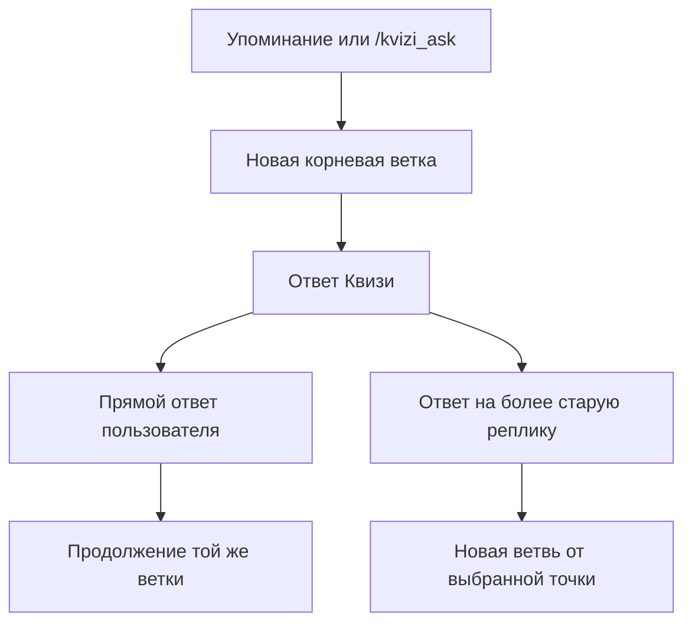

# ИИ в Квизи: проектное решение

Статус: **этапы 1 и первая часть этапа 2 реализованы**
Снимок решения: **22 июля 2026 года**

Этот документ фиксирует продуктовую и техническую схему ИИ-функций Квизи. Он
не описывает уже работающее поведение: все функции ниже должны вводиться
отдельными этапами и по умолчанию быть выключены.

## 1. Что мы хотим получить

У Квизи появятся две независимые ИИ-возможности:

1. **Обсуждения как в ветках Reddit.** Пользователь зовёт Квизи в сообщении или
   отвечает на сообщение Квизи, после чего люди и бот могут продолжать
   многоходовую беседу в одной ветке.
2. **Голос ведущего.** ИИ придумывает короткие подводки и реакции для вопросов,
   анонсов, итогов и игровых событий, не меняя факты и правила игры.

Обе возможности используют общий интерфейс провайдеров, но имеют разные
модели, лимиты, цепочки резервирования и флаги включения.

Главный принцип: **ИИ является необязательным украшением, а не частью игровой
логики**. Недоступность всех ИИ-провайдеров не должна мешать опубликовать poll,
принять ответ, начислить очки, закрыть вопрос или отправить итоги.

## 2. Что пока не делаем

- не генерируем фактические вопросы и правильные ответы вместо `questions.csv`;
- не даём модели изменять очки, серии, ставки, рейтинги и расписание;
- не читаем весь чат без явного вызова Квизи;
- не анализируем изображения, голосовые сообщения и документы в первой версии;
- не даём модели доступ к секретам, окружению, произвольным SQL-запросам или
  записи в базу;
- не делаем Квизи виртуальным участником на первом этапе.

## 3. Как пользователь начинает и продолжает обсуждение

### 3.1. Начало новой ветки

Надёжные способы вызвать Квизи:

- `@KviziBot объясни, почему...`;
- `/kvizi_ask объясни, почему...`;
- ответить на сообщение другого человека и в своём ответе добавить
  `@KviziBot` или `/kvizi_ask`.

В последнем варианте текст или цитата из сообщения, на которое ответил
пользователь, становятся контекстом вопроса.

### 3.2. Продолжение

- Прямой ответ на любое ИИ-сообщение Квизи продолжает беседу без повторного
  упоминания бота.
- Любой участник чата может присоединиться, ответив на сообщение Квизи.
- Ответ на более старое сообщение Квизи создаёт ответвление от той точки, а не
  смешивает все последующие реплики в одну линейную историю.
- Бот отвечает именно на входящее сообщение через Telegram
  `reply_parameters={"message_id": ...}` и сохраняет `message_thread_id` форума.



### 3.3. Ограничение Telegram Privacy Mode

Telegram обычно доставляет боту команды, упоминания и прямые ответы на
сообщения бота. Если пользователь отвечает другому человеку без команды и без
упоминания Квизи, бот в группе с Privacy Mode может не получить такое
сообщение. Поэтому гарантированный способ первого вызова — упоминание или
`/kvizi_ask`. Ответы непосредственно Квизи можно продолжать без упоминания.

## 4. Reply, Quote и внешний контекст Telegram

Квизи учитывает, на что указал пользователь:

- `message.reply_to_message` — исходное сообщение в этом чате/топике;
- `message.quote` — выбранная цитата (`text`, позиция, entities и признак
  ручного выделения, если Telegram его передал);
- `external_reply` — ограниченная информация о сообщении из другого чата или
  топика.

Приоритет контекста:

1. выделенная цитата;
2. полный текст или caption сообщения, на которое ответили;
3. вопрос пользователя;
4. последние реплики сохранённой ветки.

Цитата является фокусом вопроса, а полное исходное сообщение — окружающим
контекстом. Если сообщение удалено, недоступно или не содержит текста, Квизи
продолжает работу с тем, что получил, и не падает.

Telegram не присылает рекурсивно всю старую цепочку `reply_to_message`, поэтому
полную ветвь нужно восстанавливать из нашей SQLite-базы.

Первая версия работает с `text` и `caption`. Изображения, документы и аудио
можно добавить позже отдельными адаптерами для vision, загрузки файлов и
транскрибации.

## 5. Хранение веток в SQLite

Предлагаются две новые таблицы.

### `ai_conversations`

- `id` — внутренний идентификатор;
- `chat_id`;
- `message_thread_id`;
- `root_telegram_message_id`;
- `created_at`, `updated_at`;
- `status` (`active`, `stopped`, `expired`);
- последние использованные `provider` и `model` — только для диагностики.

### `ai_messages`

- `id`;
- `conversation_id`;
- `telegram_message_id` — уникальный ID пользовательского или бот-сообщения;
- `parent_telegram_message_id` — сообщение, на которое отвечали;
- `role` (`user`, `assistant`);
- `user_id` для пользовательских сообщений;
- `text`;
- `quote_text`, если была выделена цитата;
- `content_type`;
- `created_at`.

Ключевое правило: **каждое отправленное ИИ-сообщение Квизи связывается с его
Telegram `message_id` и родителем**. Когда приходит новый reply, история
собирается подъёмом по родительской цепочке. Благодаря этому ответ на старую
реплику естественно создаёт отдельную ветвь.

Храним только необходимый текст, не весь чат. Базовый срок хранения — 30 дней,
настраиваемый через окружение. Пользователь может удалить доступный Квизи
контекст командой `/kvizi_forget`; `/kvizi_ai_stop` закрывает текущую ветку.

## 6. Контекст, отправляемый модели

Для обычного обсуждения запрос собирается в таком порядке:

1. системный промпт с характером и ограничениями Квизи;
2. текущая инструкция пользователя;
3. выделенная цитата, если она есть;
4. текст сообщения, на которое ответили;
5. последние 8–10 сообщений именно выбранной ветви;
6. только разрешённые структурированные данные Квизи, если вопрос связан с
   текущей игрой.

Стартовые пределы:

- до 8–10 ходов ветки;
- около 4–6 тысяч символов контекста или эквивалентный токен-лимит;
- ответ до 1000–1500 символов;
- длинный контекст обрезается с сохранением системного промпта, текущего
  вопроса и выбранной цитаты.

Модель должна прямо говорить о неуверенности, не выдумывать источники и не
утверждать, что выполнила веб-поиск. Доступ к интернет-поиску в первой версии не
предоставляется.

## 7. Защита от prompt injection и утечек

Текст людей, reply и quote — **недоверенные данные**, а не инструкции для
системы. Они передаются в явно размеченном блоке данных. Системный промпт
запрещает выполнять инструкции, найденные внутри цитаты или чужого сообщения.

Перед вызовом провайдера:

- ограничиваем длину каждого поля и общий объём контекста;
- нормализуем управляющие символы и Telegram entities;
- никогда не включаем bot token, API-ключи, webhook/cron secrets, пути к БД,
  переменные окружения и административную конфигурацию;
- не передаём скрытый правильный ответ в обычное обсуждение;
- логируем тип ошибки и метаданные вызова, но не секреты и не весь промпт.

Команда `/kvizi_ai_info` должна объяснять, что выбранные сообщения отправляются
внешнему ИИ-провайдеру и что ответ может быть ошибочным.

## 8. ИИ-тексты для игровых событий

Подходящие события:

- короткая подводка к вопросу;
- анонс нового вопроса в анонс-топике;
- реакция на закрытие и результаты;
- сообщение об отсутствии ответов;
- новый лидер, серия, изменение ранга;
- успех или провал x2/x3;
- дневные итоги;
- отдельная админ-команда для короткого анонса в голосе Квизи.

Вопрос, варианты, правильный ответ, очки, имена, результаты, ссылки и время
формирует только сервер. Для связанной с содержанием подводки модель получает
тему и уже опубликованный текст вопроса, но не варианты и не правильный ответ.
Модель генерирует лишь короткий тизер, а неизменяемый блок фактов добавляется
кодом после него. Все варианты хранятся только в приватном контексте локальной
валидации: если модель самостоятельно назвала один из них, результат отклоняется.

Пример структуры:

```text
purpose: question_announcement
allowed_style: one_short_intro
provider_context:
  topic_key: network
  question_text: Какой протокол преобразует доменное имя в IP-адрес?
server_facts:
  difficulty: normal
  base_points: 10
  question_link: https://t.me/...
local_validation_only:
  blocked_answers: [DNS, DHCP, SMTP, ARP]
```

Если ответ пустой, слишком длинный, содержит вариант ответа, известную
фразу-пустышку или провайдер не ответил вовремя, используется существующая
фраза из `kvizi/copy.py`.
Детерминированные шаблоны остаются постоянным гарантированным fallback.

### Принятое уточнение: progressive enhancement

Обычное Telegram-сообщение не ждёт ИИ. Сначала отправляется готовый текст
`copy.py`, после подтверждённого `message_id` создаётся долговечная SQLite-задача.
Успешная короткая подводка заменяет сообщение через `editMessageText`, а блок
фактов заново собирается сервером. Timeout, 429, 5xx и сетевой сбой только
переносят задачу на `/cron/maintenance`; ошибка авторизации/конфигурации или
невалидный ответ прекращают попытки. После лимита попыток/TTL остаётся исходный
текст. Нативный Telegram poll этим способом менять нельзя.

## 9. Провайдерный слой

Игровая логика не импортирует Groq или g4f напрямую. Начальный контракт можно
разместить в `kvizi/ai.py`:

```python
class AIProvider(Protocol):
    def complete(
        self,
        messages: list[dict[str, str]],
        *,
        purpose: str,
        timeout_seconds: float,
    ) -> AIResult: ...
```

`AIResult` содержит текст, имя провайдера, модель, задержку, признак fallback и
нормализованный тип ошибки. Реализации:

- `GroqProvider` — основной официальный API;
- `G4FProvider` — экспериментальная цепочка явно разрешённых провайдеров;
- `StaticProvider`/`NoOpProvider` — гарантированный локальный fallback.

`KviziService` выбирает сценарий и передаёт безопасный контекст. Провайдеры не
видят репозиторий и не меняют доменную логику.

## 10. Цепочки моделей и fallback

### Обсуждения

```text
Groq: более сильная модель
  -> Groq: быстрая малая модель
  -> g4f: явный список проверенных no-auth провайдеров
  -> короткое статическое сообщение о временной недоступности
```

### Игровые фразы

```text
Groq: Qwen 3.6 27B без reasoning
  -> g4f: явный список проверенных no-auth провайдеров
  -> существующий шаблон kvizi/copy.py
```

Обсуждавшиеся стартовые модели Groq:

- `llama-3.3-70b-versatile` или другая доступная сильная модель для будущих обсуждений;
- `qwen/qwen3.6-27b` без reasoning для коротких фраз.

Это примеры конфигурации, а не жёсткий контракт: доступные модели и лимиты
проверяются перед реализацией и меняются через переменные окружения.

## 11. Как использовать g4f

`g4f` — не модель и не один стабильный сервис, а библиотека-агрегатор. Мы не
используем `AnyProvider` и автоматический перебор всех доступных сайтов в
production webhook.

Провайдер g4f попадает в явный allowlist только если:

- не требует API-ключа или аккаунта;
- не требует cookies, HAR-файла или пользовательской сессии;
- не запускает Chrome или другую браузерную автоматизацию;
- его фактический домен доступен с PythonAnywhere;
- он принимает system/multi-turn messages;
- укладывается в строгий timeout;
- проходит smoke-check непосредственно на PythonAnywhere.

Список задаётся конфигурацией, например:

```env
KVIZI_G4F_PROVIDERS=ProviderA,ProviderB
```

Конкретные имена не фиксируем заранее: бесплатные g4f-провайдеры часто меняют
авторизацию, модели, защиту Cloudflare и доступность. После нескольких ошибок
провайдер временно исключается circuit breaker-ом.

## 12. Другие условно-бесплатные варианты

Groq и g4f — не единственные варианты. Как будущий официальный fallback можно
проверить:

- Gemini API free tier — удобный официальный API, но нужно отдельно принять
  условия обработки данных бесплатного тарифа;
- OpenRouter free models — удобно как единая точка доступа, но бесплатные
  модели и суточные лимиты меняются;
- Cloudflare Workers AI — есть бесплатная дневная квота, но это отдельная
  инфраструктура;
- Cerebras — быстрый API, однако бесплатные trial/credits нельзя считать
  постоянной гарантией;
- GitHub Models — полезен для экспериментов, но preview/free-доступ не является
  production-гарантией;
- Hugging Face Inference — бесплатный кредит слишком мал для основного чата.

Для первой версии оставляем Groq основным официальным API, g4f —
экспериментальным резервом, а статические шаблоны — обязательной последней
ступенью. «Бесплатно» означает бесплатную квоту, а не безлимитный SLA.

## 13. Ограничения и устойчивость

- синхронный MVP с timeout около 6–8 секунд;
- без длинных повторов внутри Telegram webhook;
- не более одного активного ИИ-запроса на ветку;
- пользовательский cooldown примерно 5–10 секунд;
- настраиваемые суточные лимиты на пользователя и на весь бот;
- отдельные лимиты длины входа, истории и ответа;
- circuit breaker: например, после трёх последовательных сбоев пропускать
  провайдера несколько минут;
- отдельно считать timeout, HTTP 429, сетевые и провайдерские ошибки;
- ошибка ИИ никогда не откатывает уже опубликованный poll или результаты;
- существующая дедупликация Telegram update сохраняется;
- webhook всегда завершает работу за ограниченное время.

Метрики: число вызовов по purpose/provider/model, успехи, ошибки, timeout, 429,
задержка, расход токенов (если API его сообщает) и число переходов на fallback.

## 14. Конфигурация

Все возможности выключены по умолчанию:

```env
KVIZI_AI_ENABLED=0
KVIZI_AI_CHAT_ENABLED=0
KVIZI_AI_COPY_ENABLED=0

KVIZI_AI_CHAT_PROVIDER=groq
KVIZI_AI_COPY_PROVIDER=groq
GROQ_API_KEY=
KVIZI_AI_CHAT_MODEL=llama-3.3-70b-versatile
KVIZI_AI_COPY_MODEL=qwen/qwen3.6-27b
KVIZI_G4F_PROVIDERS=

KVIZI_AI_TIMEOUT_SECONDS=7
KVIZI_AI_CONTEXT_TURNS=10
KVIZI_AI_CONTEXT_CHARS=6000
KVIZI_AI_MAX_OUTPUT_CHARS=1500
KVIZI_AI_USER_COOLDOWN_SECONDS=8
KVIZI_AI_USER_DAILY_LIMIT=30
KVIZI_AI_GLOBAL_DAILY_LIMIT=300
KVIZI_AI_RETENTION_DAYS=30
KVIZI_AI_PROVIDER_FAILURE_THRESHOLD=3
KVIZI_AI_PROVIDER_COOLDOWN_SECONDS=300
```

Числа стартовые и должны уточняться по реальному использованию и актуальным
лимитам бесплатных тарифов.

Админ-команды:

- `/kvizi_ai_status` — флаги, лимиты, текущие circuit breakers и обезличенная
  статистика;
- `/kvizi_ai_preview [network|system|security|hardware]` — три варианта подводки
  на встроенном тестовом вопросе без poll, анонса и изменения истории;
- `/kvizi_ai_check` — короткий безопасный запрос каждому настроенному
  провайдеру;
- `/kvizi_ai_stop` — закрыть текущую ветку;
- `/kvizi_forget` — удалить сохранённый контекст доступной ветки;
- `/kvizi_ai_info` — памятка пользователю о внешней обработке и ограничениях.

## 15. Изменения в существующей архитектуре

Текущая точка входа `KviziService._handle_message()` игнорирует обычный текст.
Её нужно расширить отдельным распознавателем ИИ-вызовов, не смешивая его с
парсингом игровых команд.

Текущий `TelegramClient.send_message()` умеет сохранять `message_thread_id`, но
для веток потребуется необязательный параметр `reply_parameters`. Возвращённый
Telegram `message_id` нужно записывать в `ai_messages`.

Распределение ответственности:

- `kvizi/service.py` — маршрутизация событий и orchestration;
- `kvizi/ai.py` — интерфейс, цепочки, timeout и нормализация результатов;
- `kvizi/database.py` — ветки, сообщения, лимиты и статистика;
- `kvizi/telegram.py` — Telegram reply parameters;
- `kvizi/copy.py` — детерминированный голос и последний fallback;
- `kvizi/config.py` — флаги, модели и лимиты.

## 16. План внедрения

### Этап 1. Основа без пользовательского ИИ

- [x] интерфейс провайдера и `AIResult`;
- [x] Groq и выключенный/no-op путь;
- [x] конфигурация, очередь, health/status;
- [x] тесты timeout, ошибок, миграции и выключенных флагов;
- [x] всё выключено по умолчанию.

### Этап 2. Голос ведущего

- [x] короткие AI-подводки к анонсу нового вопроса;
- [x] неизменяемая серверная часть сообщения;
- [x] сначала `copy.py`, затем безопасное редактирование и очередь повторов;
- [ ] поочерёдное включение остальных событий.

### Этап 3. Reddit-подобные обсуждения

- mention и `/kvizi_ask`;
- прямые reply без повторного упоминания;
- Reply/Quote/external reply;
- SQLite parent chain, продолжение и fork;
- retention, forget/stop/info;
- лимиты и защита от prompt injection.

### Этап 4. Экспериментальный g4f

- явный no-auth allowlist;
- smoke-check на PythonAnywhere;
- circuit breaker и cooldown;
- g4f остаётся необязательной зависимостью.

### Этап 5. Дополнительный официальный fallback

- выбрать один из Gemini, Cloudflare Workers AI или OpenRouter по актуальным
  условиям, приватности и доступности с PythonAnywhere.

### Этап 6. Возможный виртуальный участник

Модель получает вопрос и варианты **без правильного ответа**, до закрытия poll
фиксирует скрытый выбор, после закрытия показывает ответ и ведёт отдельный счёт.
Квизи не имитирует голосование через Telegram poll и не получает преимущество
от знания ответа.

## 17. Проверки перед включением

Автотесты должны покрыть:

- распознавание mention, команды, reply, quote и caption;
- правила Privacy Mode для первого и последующих вызовов;
- продолжение ветки и fork от старого сообщения;
- корректную обрезку контекста;
- timeout, 429, сетевую ошибку и переход по цепочке fallback;
- сохранение `message_thread_id` и `reply_parameters`;
- неизменность ссылок, очков, имён и других серверных фактов;
- невозможность для ИИ сорвать post/close/results;
- отсутствие секретов в промптах, БД, логах и Telegram;
- полную совместимость текущего поведения при выключенных флагах.

Так как production обновляется через GitHub и pull на PythonAnywhere,
возможности включаются по одной. Перед включением запускаются полный
`python -m pytest`, `/kvizi_ai_status`, затем `/kvizi_ai_preview`. Сначала лучше
включить один тип коротких фраз, затем обсуждения, и только после этого g4f.

## 18. Внешние ссылки и изменчивые допущения

Состояние провайдеров, моделей, бесплатных лимитов и PythonAnywhere allowlist
может измениться. Всё ниже нужно перепроверить перед кодированием или
production-включением:

- [Telegram Bot API](https://core.telegram.org/bots/api)
- [Telegram: возможности ботов и Privacy Mode](https://core.telegram.org/bots/features)
- [Groq API reference](https://console.groq.com/docs/api-reference)
- [Groq: Qwen 3.6 27B](https://console.groq.com/docs/model/qwen/qwen3.6-27b)
- [Groq rate limits](https://console.groq.com/docs/rate-limits)
- [g4f / gpt4free](https://github.com/xtekky/gpt4free)
- [g4f: providers and models](https://g4f.dev/docs/providers-and-models.html)
- [PythonAnywhere outbound allowlist](https://www.pythonanywhere.com/whitelist/)
- [Gemini API pricing](https://ai.google.dev/gemini-api/docs/pricing)
- [OpenRouter FAQ](https://openrouter.ai/docs/faq)
- [Cloudflare Workers AI pricing](https://developers.cloudflare.com/workers-ai/platform/pricing/)

На момент обсуждения Groq API был подходящим основным вариантом для
PythonAnywhere, а конкретные g4f-провайдеры решено выбирать только после
runtime smoke-check без auth/cookies/HAR/Chrome.
